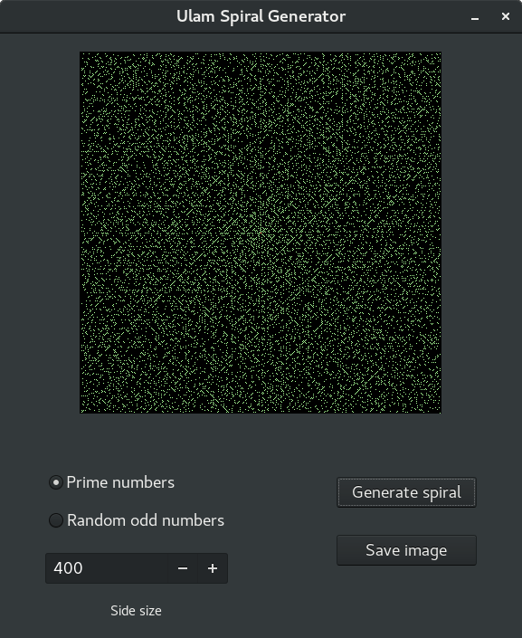

# Ulam spiral generator

This project is the simple GTK based program which generates prime numbers and plots it into Ulam spiral.

## Reference

For details about the general concept of the fascinating phenomenon of the prime numbers spiral, please check [Ulam spiral](https://en.wikipedia.org/wiki/Ulam_spiral).

